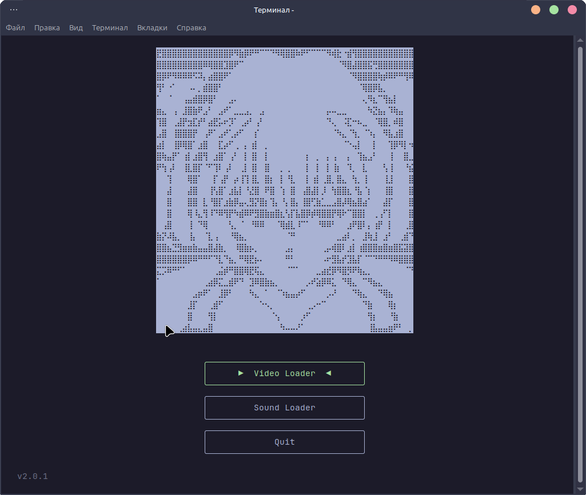
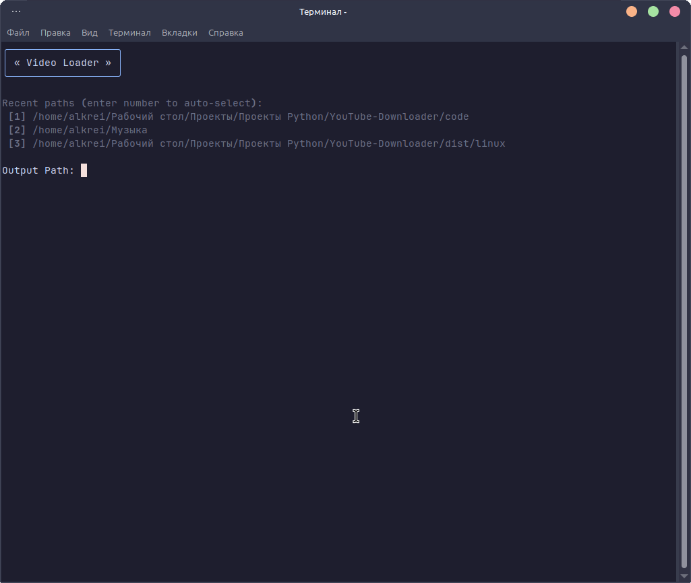
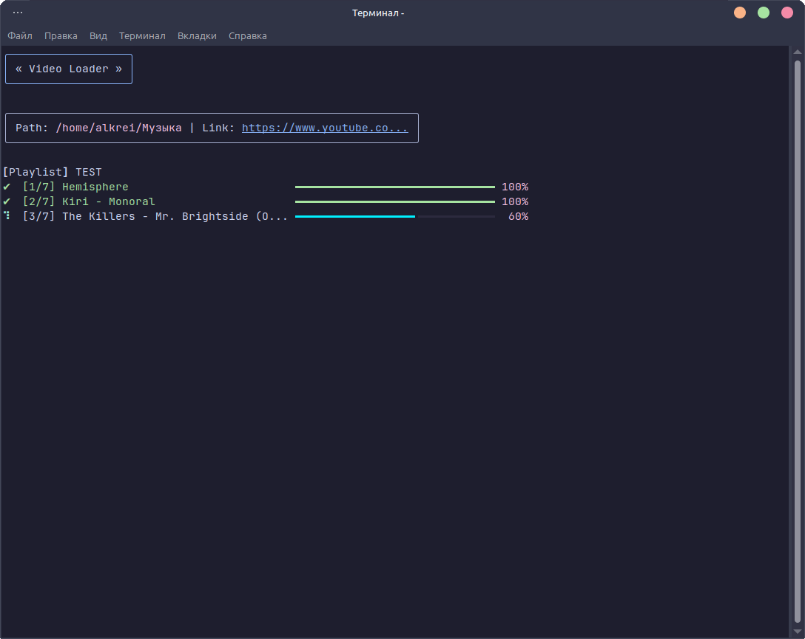
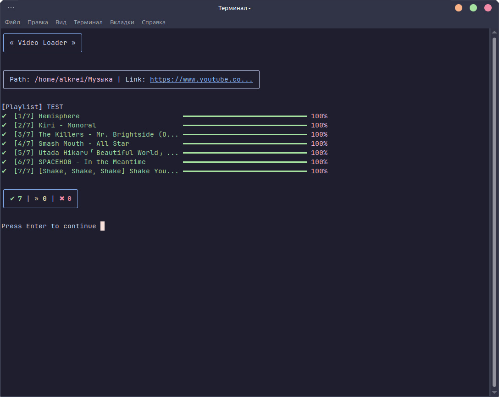

# YouTube-Downloader (YTD)


|  | A Python-based terminal application for downloading videos and audio from YouTube. It combines a text user interface (TUI) for navigation with a command-line interface for the download process. |
| :--- | :--- |









## Features
*   **Download Videos, Playlists, or Audio:** Easily download single videos or entire playlists. Choose between high-quality video (MP4) or audio-only extraction (MP3 with embedded thumbnails and metadata).
*   **Smart Path History:** Automatically saves and allows you to quickly select from your 3 most recently used download directories.
*   **Interactive TUI Menu:** Built with `Textual` for intuitive keyboard and mouse navigation.
*   **Progress Tracking:** Visual progress bars using `Rich` for real-time download status.
*   **Error Classification:** Clear and concise explanations for common errors (network issues, age restrictions, geo-blocks, missing FFmpeg, etc.).

## Quick Start (Ready-to-use Release)
You don't need to install Python or any dependencies to use the app!
1. Go to the [Releases](https://github.com/arukurei/YouTube-Downloader/releases) page.
2. Download the latest executable file for your operating system.
3. Run the downloaded file—no installation required! 

*(Note: You still need to have **FFmpeg** installed on your system for audio extraction and video merging).*

## Installation (From Source)
If you prefer to run the application from the source code:

1. Ensure you have **Python 3.8 or higher** installed.
2. Clone the repository or copy the source files.
3. Install the required dependencies:
   ```bash
   pip install yt-dlp rich textual imageio-ffmpeg
   ```
4. Ensure **FFmpeg** and **FFprobe** are installed on your system and added to your system path.

## Usage
If you downloaded the release version, simply double-click the executable.
If you are running from source, open your terminal and execute:

```bash
python main.py
```

*   Use **Up/Down arrow keys** or the **Mouse** to navigate the menu.
*   Press **Enter** or click to select an option.
*   Enter the output directory path (or easily select one from your saved history) and the URL when prompted.
*   Type `/test` in the URL prompt to run a simulated visualization test.
