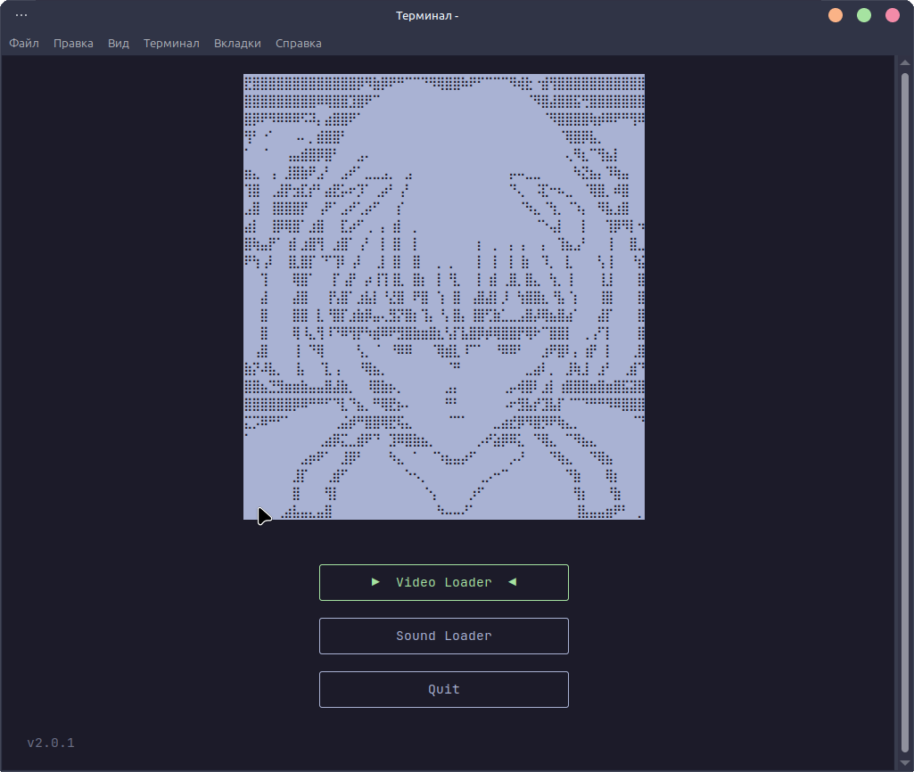
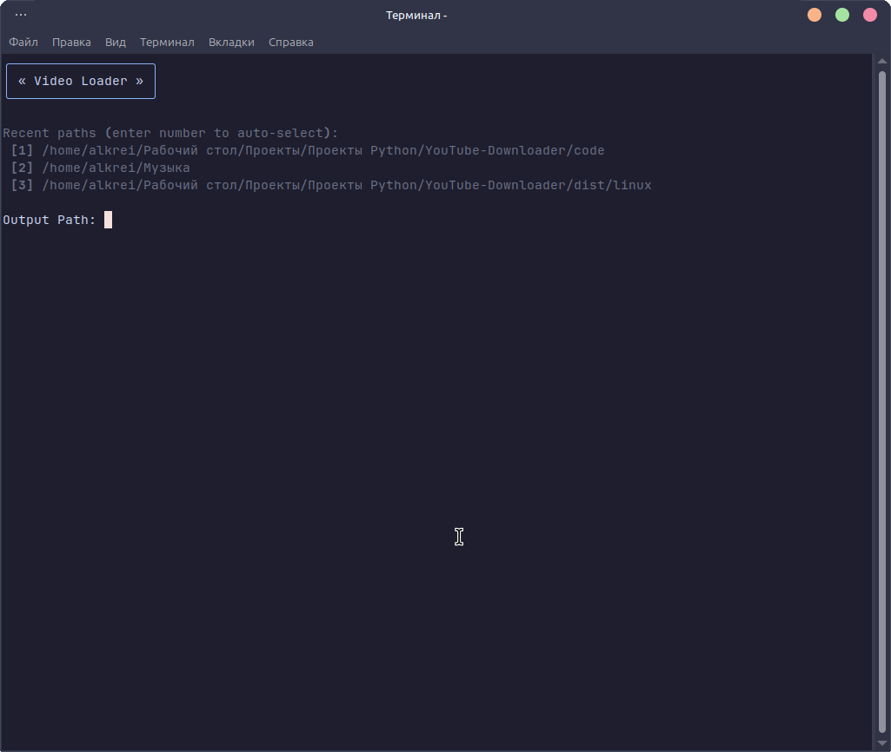
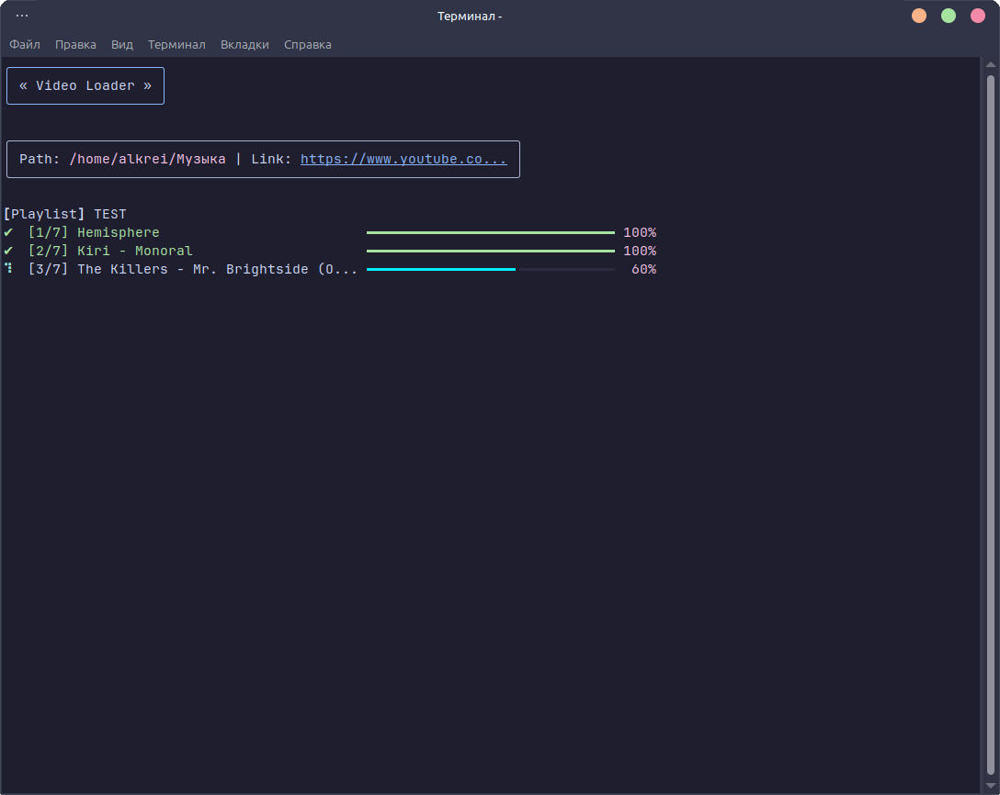
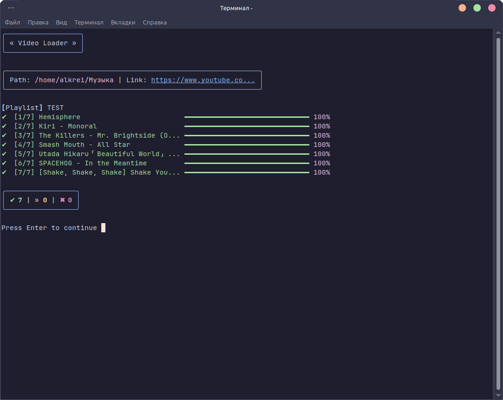

#  YouTube-Downloader (YTD)

> A modern terminal application (TUI) for downloading YouTube videos and audio. Combines an interactive keyboard/mouse interface with a fast, resilient download engine.

[](https://github.com/arukurei/YouTube-Downloader/releases)
[](https://python.org)
[](https://textual.textualize.io/)
[](https://github.com/yt-dlp/yt-dlp)

---

<p align="center">
  
  
</p>
<p align="center">
  
  
</p>

## Features

* **Interactive TUI:** Sleek terminal interface built on `Textual` with full arrow-key and mouse support.
* **Smart Binary Updater:** Automatically checks, downloads, and updates the standalone `yt-dlp` binary on startup without hitting GitHub API rate limits.
* **Audio & Video Extraction:**
  * **Video:** Merged high-quality video (`MP4`) with embedded thumbnails.
  * **Audio:** High-quality MP3 (`192 kbps`) with cover art and metadata embedding.
* **Reliable & Resilient:** Automatic retry mechanism with backoff for unstable connections, plus auto-cleanup of leftover/corrupted `.part` files on failure.
* **Skip Existing Files:** Detects already downloaded tracks and skips them instantly to save bandwidth.
* **Full Playlist Support:** Sequential downloading with dynamic counters `[idx/total]` and progress bars powered by `Rich`.
* **Smart History:** Remembers your last 3 download paths for 1-click selection.
* **Intelligent Diagnostics:** Translates raw errors into actionable advice (Geo-blocks, age restrictions, VPN recommendations, disk space issues).
* **Mock Sandbox Mode:** Type `/test` in the URL prompt to preview all UI states, progress bars, and error conditions without downloading anything.

---

## Quick Start (Pre-compiled Releases)

> [!TIP]
> **No Python or dependencies required!** Grab the pre-compiled standalone executable from the Releases tab and run it immediately.

1. Go to the [Releases](https://github.com/arukurei/YouTube-Downloader/releases) page.
2. Download the latest binary for your operating system (Windows / Linux).
3. Run the executable — FFmpeg and yt-dlp handling are already set up!

---

## Run from Source

### Requirements
* **Python 3.8+**
* **FFmpeg & FFprobe** installed on your system (or supplied via `portable-ffmpeg`).

### Installation
1. Clone this repository:
   ```bash
   git clone https://github.com/arukurei/YouTube-Downloader.git
   cd YouTube-Downloader
   ```

2. Install Python dependencies:
   ```bash
   pip install rich textual portable-ffmpeg
   ```

3. Start the application:
   ```bash
   python code/main.py
   ```

---

## Usage

1. Select **Video Loader** or **Sound Loader** using the **Arrow keys** or **Mouse**.
2. **Output Path:** Enter a path or pick a number `[1-3]` from your recent directory history.
3. **URL:** Paste a YouTube video or playlist link (or type `/test` for the UI test suite).
4. Monitor downloads via live progress bars and informative status logs.
